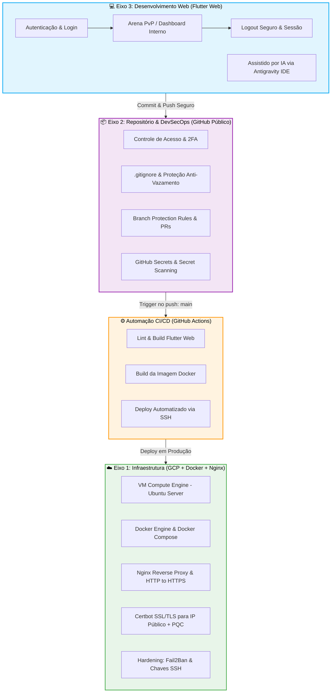
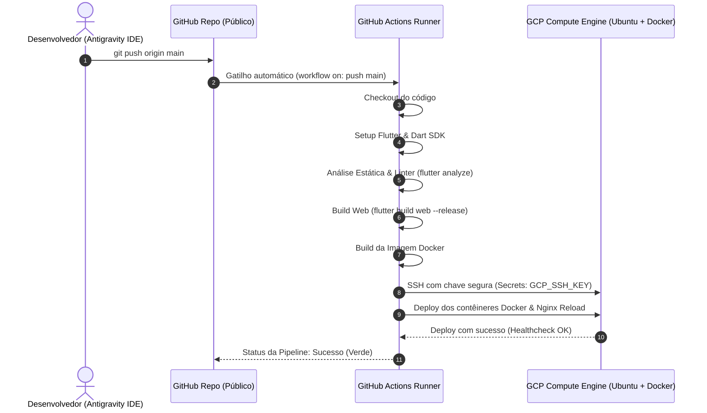

# 🏛️ Arquitetura e Diretrizes do Projeto - PromptSec Arena

Este documento detalha o desenho de arquitetura de software, infraestrutura de nuvem, segurança da informação e práticas de DevSecOps para o **PromptSec Arena**, alinhando o projeto às exigências da disciplina **Projeto Aplicado: Práticas de Mercado** e aos conceitos de *Secure by Design* e *Secure by Default*.

---

## 🧭 Visão Geral dos Três Eixos

O ecossistema do PromptSec Arena é estruturado a partir da integração contínua entre desenvolvimento, versionamento seguro e infraestrutura de nuvem com conteinerização:



---

## ☁️ Eixo 1: Infraestrutura (Cloud Computing no GCP com Docker)

### 1.1 Provedor e Computação
* **Provedor:** Google Cloud Platform (GCP).
* **Instância:** VM no Google Compute Engine (ex: `e2-micro` ou `e2-small` enquadrada no nível gratuito/Free Tier).
* **Sistema Operacional:** **Ubuntu Server 24.04 LTS** (ou Debian 12 estável), atendendo à obrigatoriedade da disciplina.
* **Conteinerização com Docker:** 
  * A aplicação web (Flutter Web) e os serviços auxiliares são encapsulados em contêineres Docker gerenciados via `docker-compose`.
  * Isso garante isolamento do ambiente de execução, imutabilidade dos artefatos gerados e facilidade de deploy e rollback.

### 1.2 Servidor Web e Reverse Proxy
* **Servidor Web:** **Nginx** atuando diretamente no host ou como container de borda (*Edge Proxy*).
* **Funções do Nginx:**
  * Terminalização de TLS/SSL.
  * Redirecionamento forçado de todo tráfego HTTP (porta 80) para HTTPS (porta 443) com status `301 Moved Permanently`.
  * Proxy reverso encaminhando requisições para a porta interna do container Docker da aplicação Flutter Web (`http://127.0.0.1:8080`).
  * Injeção de cabeçalhos de segurança HTTP (*Security Headers*):
    * `Strict-Transport-Security: max-age=63072000; includeSubDomains; preload`
    * `X-Frame-Options: DENY`
    * `X-Content-Type-Options: nosniff`
    * `Content-Security-Policy: default-src 'self'; script-src 'self' 'unsafe-eval' 'unsafe-inline'; style-src 'self' 'unsafe-inline';`

### 1.3 Requisitos de Hardening e Segurança
* **Acesso Administrativo via SSH:**
  * Acesso remoto restrito a **chaves criptográficas SSH** (Ed25519 ou RSA 4096-bit).
  * Autenticação por senha estritamente desativada no arquivo de configuração do daemon SSH (`/etc/ssh/sshd_config`):
    ```bash
    PasswordAuthentication no
    PermitRootLogin no
    PubkeyAuthentication yes
    ```
* **Firewall (GCP VPC Firewall Rules) - Princípio do Menor Privilégio:**
  * Abertura exclusiva das portas essenciais para o tráfego de rede:
    * `TCP 80` (HTTP - apenas para redirecionamento)
    * `TCP 443` (HTTPS - tráfego seguro de aplicação)
    * `TCP 22` (SSH - gerência com proteção)
  * Todas as demais portas internas e de containers permanecem bloqueadas para o exterior.
* **Proteção contra Força Bruta (Fail2Ban):**
  * Instalação e ativação do `fail2ban` monitorando tentativas na porta 22 do SSH.
  * Regra em `/etc/fail2ban/jail.local`:
    ```ini
    [sshd]
    enabled = true
    port = ssh
    filter = sshd
    logpath = /var/log/auth.log
    maxretry = 4
    bantime = 86400
    findtime = 600
    ```
  * Configurado com **tolerância de 4 erros** (`maxretry = 4`) e **tempo de banimento de 24 horas** (`bantime = 86400`).
* **Criptografia e Certificado SSL/TLS:**
  * Emissão de certificado via **Certbot** (versão 5.4 ou superior) com suporte à emissão para **endereços IP públicos** diretamente pela Let's Encrypt (ou associado a hostname dinâmico/domínio caso configurado).
  * Habilitação de autorrenovação periódica via `cron` ou `systemd timer` (`certbot renew --quiet`).
  * Ativação de suporte a **Post-Quantum Cryptography (PQC)** nas suítes de cifras e troca de chaves TLS (ex: grupos híbridos `X25519MLKEM768` no Nginx/OpenSSL), validado via testes oficiais do [SSL.org](https://www.ssl.org/), [Digicert PQC Checker](https://www.digicert.com/pqc-checker) ou [Qualys SSL Labs](https://www.ssllabs.com/ssltest/) obtendo nota A/Conformidade.

---

## 📦 Eixo 2: Repositório (Controle de Versão Seguro no GitHub Público)

O repositório do projeto adota modelo **público** (conforme requisito obrigatório da disciplina), exigindo atenção redobrada à prevenção de vazamento de segredos, proteção de branches e governança DevSecOps.

### 2.1 Políticas de Segurança no Repositório
* **Repositório Público e Acesso:** O código-fonte é hospedado em repositório público no GitHub para livre acesso, transparência e avaliação acadêmica, sem abrir mão do controle estrito sobre commits e releases.
* **Autenticação Segura de Desenvolvedores:**
  * Obrigatoriedade de Autenticação em Dois Fatores (2FA) na conta GitHub.
  * Operações de `git clone`, `push` e `pull` realizadas exclusivamente com **chaves SSH** ou **Personal Access Tokens (PAT)** com escopos limitados e data de expiração definida.
* **Branch Protection Rules (Proteção da Branch `main`):**
  * Bloqueio de commits diretos na branch principal (`main`).
  * Exigência de Pull Requests (PR) com revisão e aprovação obrigatória.
  * Exigência de passagem com sucesso nas verificações automáticas de CI (lint, testes, build).
* **Prevenção de Vazamento de Credenciais:**
  * Configuração robusta do arquivo `.gitignore` bloqueando:
    * Arquivos `.env` e `.env.*`
    * Chaves privadas de SSH (`id_rsa`, `id_ed25519`, `.pem`)
    * Credenciais da GCP (`service-account.json`, credenciais de gcloud)
    * Certificados locais e arquivos de configuração sensíveis
    * Artefatos temporários de build do Flutter/Dart (`.dart_tool/`, `build/`)
  * **GitHub Secret Scanning & Push Protection:** Ativação da proteção nativa do GitHub para rejeitar commits contendo tokens, chaves de API ou segredos antes de serem integrados ao histórico.
* **Gestão de Segredos:**
  * Todas as variáveis sensíveis utilizadas pela esteira CI/CD (ex: chave SSH para acesso ao servidor de deploy, credenciais do GCP) são armazenadas de forma encriptada nos **GitHub Actions Secrets**.

---

## 💻 Eixo 3: Desenvolvimento Web (Flutter Web & Secure by Design)

O frontend é desenvolvido em **Flutter Web**, proporcionando uma interface responsiva, dinâmica e compilada para os padrões web modernos.

### 3.1 Assistência por IA no Desenvolvimento
* Todo o processo de codificação, design de componentes e modelagem de segurança é realizado com assistência da ferramenta **Google Antigravity IDE**, utilizando IA para:
  * Geração e refatoração de código Dart/Flutter seguro.
  * Auditoria estática de vulnerabilidades e boas práticas de tipagem.
  * Criação de testes unitários e de integração para validação de sanitização.

### 3.2 Estrutura Mínima Obrigatória
1. **Tela de Login (`/login`):**
   * Interface de autenticação com validação de formato e sanitização de credenciais.
   * Feedback visual amigável sem vazar informações sobre existência de usuários (prevenção de *User Enumeration*).
2. **Página Interna - Arena de Jogo / Dashboard (`/arena`):**
   * Acessível **exclusivamente após autenticação bem-sucedida**.
   * Protegida por guards de navegação (*Route Guards* / middleware de autenticação).
   * Exibe o painel do PromptSec Arena: visão do Red Team (injeção de prompt), Blue Team (patch dinâmico de system prompt) e barra de logprobs/tensão do LLM.
3. **Botão de Logout Funcional:**
   * Ação explícita de encerramento de sessão.
   * Invalidação do token/sessão no cliente, limpeza do estado local de autenticação e redirecionamento imediato para a tela de login.

### 3.3 Mitigação de Vulnerabilidades OWASP Top 10:2025

O código-fonte do PromptSec Arena implementa salvaguardas explícitas contra três categorias críticas do [OWASP Top 10:2025](https://owasp.org/Top10/2025/):

| Categoria OWASP | Descrição da Ameaça no Contexto do Projeto | Estratégia de Mitigação Implementada |
| :--- | :--- | :--- |
| **A01:2025 - Broken Access Control** | Usuários não autenticados tentando acessar diretamente a URL interna da Arena ou jogadores manipulando papéis (ex: Red Team editando System Prompt de Blue Team). | **Route Guards reativos no Flutter Web:** interceptação de rotas garantindo que páginas restritas exijam token válido; validação de perfis/papéis (*Role-Based Access Control*) em todas as ações de jogo e invalidação no logout. |
| **A03:2025 - Injection (Prompt & Client Injection)** | Injeção de scripts maliciosos (XSS) através dos prompts digitados pelos jogadores ou injeção de comandos não autorizados no modelo de linguagem. | **Sanitização estrita de inputs no client Flutter:** codificação de entidades HTML/caracteres especiais antes da renderização; uso de renderizadores seguros do Flutter; no fluxo de LLM, encapsulamento de prompts em delimitadores estruturados para isolar dados de instruções do sistema. |
| **A07:2025 - Identification and Authentication Failures** | Ataques de força bruta no login, reutilização de sessões inválidas ou armazenamento inseguro de credenciais no navegador. | **Mecanismos de autenticação robustos:** limitação de tentativas no cliente com delay exponencial; armazenamento de tokens com tempo de expiração curto; destruição completa da sessão no storage local ao acionar o Logout. |

---

## 🔄 Pipeline de Integração e Entrega Contínuas (CI/CD)

A entrega da aplicação é 100% automatizada via **GitHub Actions**. Qualquer push validado na branch `main` dispara o processo de integração, build do container e implantação no GCP.



### Exemplo de Workflow do GitHub Actions (`.github/workflows/deploy.yml`)
```yaml
name: CI/CD Pipeline - PromptSec Arena

on:
  push:
    branches: [ "main" ]

jobs:
  build-and-deploy:
    runs-on: ubuntu-latest
    steps:
      - name: Checkout do Repositório
        uses: actions/checkout@v4

      - name: Configurar Flutter SDK
        uses: subosito/flutter-action@v2
        with:
          flutter-version: '3.19.x'
          channel: 'stable'

      - name: Instalar Dependências e Testar
        run: |
          flutter pub get
          flutter analyze

      - name: Build Flutter Web
        run: flutter build web --release

      - name: Build da Imagem Docker
        run: |
          docker build -t promptsec-arena:latest .

      - name: Deploy na VM do GCP via SSH Seguro
        uses: appleboy/ssh-action@v1.0.3
        with:
          host: ${{ secrets.GCP_VM_IP }}
          username: ${{ secrets.GCP_SSH_USER }}
          key: ${{ secrets.GCP_SSH_PRIVATE_KEY }}
          port: 22
          script: |
            cd /opt/promptsec-arena
            git pull origin main
            docker compose down
            docker compose up -d --build
            sudo nginx -s reload
```

---

## 📋 Resumo de Conformidade Técnica

| Item | Diretriz da Disciplina | Solução Adotada no PromptSec Arena |
| :--- | :--- | :--- |
| **Eixo 1 (Cloud)** | Ubuntu Server/Debian + Nginx/Apache + IP público + Chaves SSH + Fail2Ban + SSL IP com Let's Encrypt + PQC | GCP Compute Engine (Ubuntu 24.04 LTS), Docker, Nginx, Certbot 5.4+ (IP público Let's Encrypt), Fail2Ban (4 erros, ban 24h), Suporte PQC ativo. |
| **Eixo 2 (Repo)** | Repositório público, versionamento seguro, sem credenciais expostas, .gitignore adequado | GitHub Público, Secret Scanning, Push Protection, Branch Protection na `main`, GitHub Secrets para chaves SSH, `.gitignore` blindado. |
| **Eixo 3 (Dev)** | Web livre, Login, Página Interna, Logout, Mitigação de 3 OWASPs, IDE com IA | Flutter Web, tela de Login, Arena interna de jogo, botão de Logout, mitigação de A01, A03 e A07 (OWASP 2025), desenvolvido no Google Antigravity IDE. |
| **CI/CD** | GitHub Actions automatizado no push para a branch `main` | Workflow no GitHub Actions com lint, build Flutter Web, build Docker e deploy automatizado via SSH seguro. |
